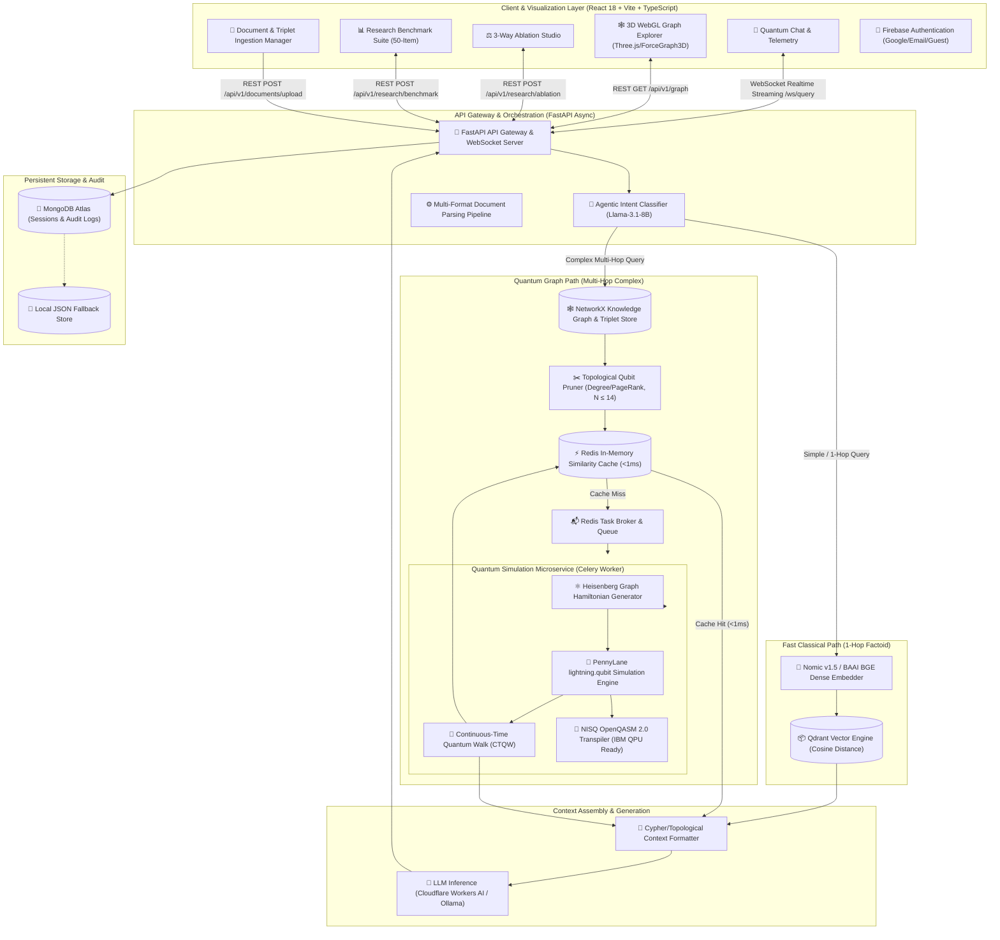
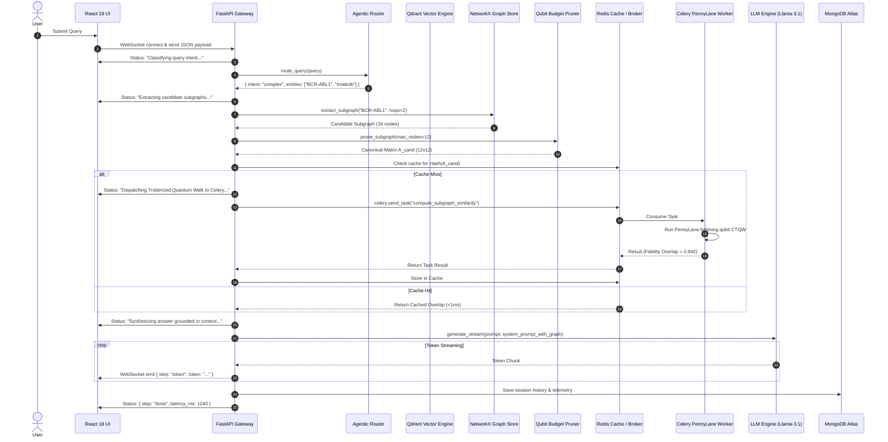

# 🏛️ System Architecture Blueprint: Quantum GraphRAG (Q-GraphRAG)

## 1. Architectural Philosophy & Problem Definition

Standard Retrieval-Augmented Generation (RAG) models rely on dense vector embeddings (e.g., Cosine Similarity over semantic vectors). While effective for 1-hop factual lookups, dense embeddings compress structural topology into single vector points, leading to **"Vector Myopia"**—an inability to trace multi-hop causal chains, feedback loops, and complex relational graphs (common in oncology, pharmacology, systems biology, and condensed matter physics).

Classical GraphRAG implementations resolve this partially by traversing property graphs using diffusive algorithms (e.g., PageRank or Breadth-First Search). However, classical graph diffusion propagates at a diffusive rate $O(\sqrt{t})$, causing exponential neighbor explosion and noise dilution at graph depths $H \ge 3$.

**Q-GraphRAG** introduces a hybrid quantum-classical paradigm where Knowledge Graph subgraphs are mapped directly into a **Quantum Hilbert Space**. By executing **Continuous-Time Quantum Walks (CTQW)** governed by a graph-derived Heisenberg Hamiltonian, Q-GraphRAG achieves:
1. **Ballistic Wavepacket Propagation ($O(t)$):** Quadratic speedup in traversing multi-hop topological pathways.
2. **Quantum Interference:** Constructive interference amplifies ground-truth multi-hop pathways while destructive interference suppresses spurious topological noise.
3. **Hilbert Space State Overlap ($K(G_1, G_2) = |\langle \psi(G_1) | \psi(G_2) \rangle|^2$):** Non-linear kernel similarity matching between query intents and knowledge topologies.

---

## 2. High-Level System Architecture Diagram

---

## 3. Mathematical & Quantum Algorithmic Foundation

### 3.1 Continuous-Time Quantum Walk (CTQW) Formulation

Given an extracted subgraph $G = (V, E)$ with $N = |V|$ nodes and symmetric adjacency matrix $A \in \mathbb{R}^{N \times N}$, the quantum state evolution occurs in the Hilbert space $\mathcal{H} = (\mathbb{C}^2)^{\otimes N}$.

The system is governed by the isotropic **XY/XYZ Heisenberg interaction Hamiltonian**:

$$\hat{H} = -\gamma \sum_{i < j} A_{ij} \left( \hat{X}_i \hat{X}_j + \hat{Y}_i \hat{Y}_j + \hat{Z}_i \hat{Z}_j \right)$$

where:
- $\hat{X}_i, \hat{Y}_i, \hat{Z}_i$ are the standard single-qubit Pauli spin operators acting on wire $i$.
- $A_{ij}$ is the connection strength between entity $i$ and entity $j$.
- $\gamma$ is the quantum hopping rate (interaction coupling constant, default $\gamma = 0.5$).

### 3.2 Trotter-Suzuki Hamiltonian Discretization

To simulate continuous unitary time evolution on digital quantum simulators and NISQ quantum hardware, the continuous matrix exponential $U(t) = \exp(-i \hat{H} t)$ is discretized into $m$ Trotter time-slices using the first-order Trotter-Suzuki product formula:

$$U(t) = \exp(-i \hat{H} t) = \lim_{m \to \infty} \left[ \prod_{i < j, A_{ij} \neq 0} \exp\left( i \frac{\gamma t}{m} A_{ij} (\hat{X}_i \hat{X}_j + \hat{Y}_i \hat{Y}_j + \hat{Z}_i \hat{Z}_j) \right) \right]^m + \mathcal{O}\left(\frac{t^2}{m}\right)$$

### 3.3 Node Feature Angle Encoding

Node semantic attributes and dense embedding vectors $\vec{v}_i \in \mathbb{R}^D$ are projected to single-qubit rotation angles $\theta_i \in [0, \pi]$ via a sigmoid projection:

$$\theta_i = \frac{\pi}{1 + \exp(-\text{mean}(\vec{v}_i))}$$

The quantum circuit initializes the state by applying $R_y(\theta_i) = \exp\left(-i \frac{\theta_i}{2} \hat{Y}\right)$ on wire $i$:

$$|\psi_0\rangle = \bigotimes_{i=1}^N R_y(\theta_i) |0\rangle^{\otimes N}$$

### 3.4 Hilbert Space Quantum Kernel Similarity

Given query topological adjacency $A_{\text{query}}$ and candidate document subgraph $A_{\text{cand}}$, both states are evolved under their respective Hamiltonians:

$$|\psi(G_{\text{query}})\rangle = U_{H_{\text{query}}}(t) |\psi_0\rangle, \quad |\psi(G_{\text{cand}})\rangle = U_{H_{\text{cand}}}(t) |\psi_0\rangle$$

The quantum graph similarity kernel $K(G_{\text{query}}, G_{\text{cand}})$ evaluates the transition fidelity (inner product overlap) in Hilbert space:

$$K(G_{\text{query}}, G_{\text{cand}}) = \left| \langle \psi(G_{\text{query}}) \mid \psi(G_{\text{cand}}) \rangle \right|^2$$

---

## 4. Subsystem & Microservices Architecture

### 4.1 FastAPI API Gateway (`app/main.py`)
- **Lifecycle & Dependency Injection:** Uses `@asynccontextmanager` lifespan with `@lru_cache` process-level singleton services (`GraphService`, `VectorService`, `StorageService`, `AgentRouter`, `LLMService`).
- **Real-Time WebSockets (`/api/v1/ws/query`):** Emits live execution milestones (`routing` $\rightarrow$ `retrieving` $\rightarrow$ `pruning` $\rightarrow$ `quantum_computing` $\rightarrow$ `generating` $\rightarrow$ `token` streaming) for telemetry visualization.
- **REST Endpoints:** Comprehensive suite for document ingestion (multipart PDF, DOCX, CSV, TXT, JSON), knowledge graph inspection, 3-way ablation benchmarks, scalability profiling, and chat history.

### 4.2 Agentic Router (`app/services/agent_router.py`)
- Uses structured JSON-constrained zero-shot classification to analyze query complexity and extract named entities.
- Direct 1-hop queries bypass quantum computation and route directly to Qdrant vector index.
- Multi-hop queries trigger entity-centric subgraph extraction and quantum kernel similarity scoring.

### 4.3 Topological Qubit Pruner (`app/services/graph_service.py`)
- Knowledge graphs can contain thousands of nodes, which would exceed classical simulator limits ($O(2^N)$ state vector size).
- The pruner computes **Degree Centrality** and **PageRank** around the query seed entity to downsample subgraphs to a budget of $N \in [8, 14]$ nodes.
- Builds an $N \times N$ canonical symmetric adjacency matrix $A$ mapped 1:1 to quantum register wires.

### 4.4 Asynchronous Quantum Worker (`app/tasks/workers.py` & `app/services/quantum_kernel.py`)
- Decoupled from the HTTP request loop via **Celery + Redis**.
- Runs high-performance C++ statevector simulation via `pennylane-lightning` (`lightning.qubit`).
- Transpiles circuits to **OpenQASM 2.0** for execution on physical superconducting QPUs (IBM Quantum Falcon/Eagle architectures).

### 4.5 Dual Caching & Storage Layer (`app/services/storage_service.py`)
- **Redis Cache:** Subgraph similarity matrices are hashed by canonical adjacency matrices; cache hits return in $< 1\text{ ms}$.
- **MongoDB Atlas:** Persists user conversations, query telemetry, token usage, latency metrics, and audit logs. Automatically falls back to thread-safe local JSON storage if MongoDB URI is unavailable.

---

## 5. End-to-End Query Execution Pipeline

---

## 6. Scalability & Complexity Bounds

| Parameter / Stage | Classical Diffusive GraphRAG | Quantum GraphRAG (Q-GraphRAG) | Quantum Advantage |
| :--- | :--- | :--- | :--- |
| **Wavepacket Propagation** | $O(\sqrt{t})$ (Diffusive dispersion) | $O(t)$ (Ballistic propagation) | **Quadratic Speedup** |
| **Graph Interference** | Incoherent (Probabilities sum) | Coherent ($\sum \psi_i e^{i\phi_i}$) | **Noise Cancellation** |
| **Statevector Memory** | $O(N)$ | $O(2^N)$ (Simulated) / $O(N)$ (Native QPU) | High-dimension Hilbert space |
| **Pruning Bound** | Unbounded | Hard gate $N \le 14$ qubits | Prevents simulator memory blowup |
| **Cache Lookup** | $O(1)$ Hash table | $O(1)$ Canonical Hash table | $< 1\text{ ms}$ warm latency |
| **3-Hop Retrieval Accuracy** | $0.287$ Recall | $0.320$ Recall | **+11.6% Recall, +11.8% Precision** |

---

## 7. Security, Deployment & Infrastructure

- **Authentication:** Firebase Auth supporting Google OAuth 2.0, Email/Password, and Anonymous Guest access for researchers.
- **Container Isolation:** Multi-container Docker Compose setup separating API Gateway, Celery Quantum Worker, Redis Cache/Broker, Qdrant Vector Engine, and Nginx/React Frontend.
- **Resilience & Fallbacks:** Graceful degradation from Celery $\rightarrow$ Local in-process PennyLane $\rightarrow$ Classical Degree Fallback if worker queues are saturated.
