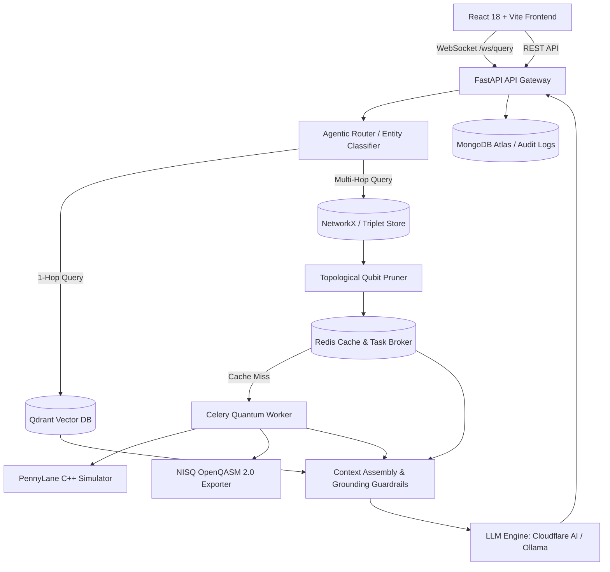

<div align="center">

# ⚛️ Quantum GraphRAG (Q-GraphRAG)

### *Cloud-Native Hybrid Quantum-Classical Retrieval-Augmented Generation*

[](https://fastapi.tiangolo.com)
[](https://pennylane.ai)
[](https://qdrant.tech)
[](https://reactjs.org)
[](https://www.docker.com)
[](LICENSE)

<p align="center">
  <b>A peer-reviewed, production-ready enterprise framework that bridges Knowledge Graphs, Continuous-Time Quantum Walks (CTQW), Multi-Agent Orchestration, and NISQ Quantum Hardware to significantly mitigate hallucinations in deep multi-hop reasoning.</b>
</p>

[System Architecture](#-system-architecture) •
[Quantum Mechanics Foundation](#-quantum-mechanics--algorithmic-foundation) •
[Key Features](#-key-features) •
[Empirical Benchmarks](#-peer-reviewed-empirical-benchmarks) •
[Quick Start](#-quick-start--local-setup) •
[Deployment Guide](#-production-deployment) •
[API Reference](#-api--websocket-reference)

---

</div>

## 📌 1. Executive Summary

Standard Retrieval-Augmented Generation (RAG) compresses unstructured domain documents into dense vector embeddings and retrieves context via cosine similarity. While effective for simple 1-hop factoids, dense embeddings suffer from **"Vector Myopia"**—an inherent inability to retain higher-order topological relationships across deeply interconnected entity graphs (e.g., precision oncology signaling cascades, drug-gene interactions, or complex financial risk graphs).

Classical GraphRAG approaches resolve this partially with graph traversal algorithms (e.g., PageRank or Breadth-First Search). However, classical graph diffusion propagates at a diffusive rate $\mathcal{O}(\sqrt{t})$, causing rapid neighbor explosion and noise dilution at multi-hop depths ($H \ge 3$).

**Quantum GraphRAG (Q-GraphRAG)** solves this by extracting Knowledge Graph subgraphs and mapping their topological adjacency matrices into a **Quantum Hilbert Space**. Governed by a graph-derived **XY/XYZ Heisenberg Hamiltonian**, a **Continuous-Time Quantum Walk (CTQW)** achieves **ballistic wavepacket dispersion ($\mathcal{O}(t)$)** and quantum interference, evaluating non-linear topological graph kernels ($K(G_1, G_2) = |\langle \psi(G_1) | \psi(G_2) \rangle|^2$) to retrieve contextually pristine, multi-hop subgraphs that significantly mitigate hallucinations.

---

## 🏛️ 2. System Architecture

Q-GraphRAG is built as a cloud-native, microservices-driven architecture decoupled for sub-millisecond query routing and scalable quantum simulation.

```
                               +-----------------------+
                               |      User Query       |
                               +-----------+-----------+
                                           |
                                           v
                               +-----------------------+
                               |  Agentic Router Node  |
                               +-----+-----------+-----+
                                     |           |
         (Simple 1-Hop Query)        |           |        (Complex Multi-Hop Query)
    +--------------------------------+           +--------------------------------+
    |                                                                             |
    v                                                                             v
 +--------------+                                                          +--------------------+
 | Classical    |                                                          |  Neo4j / NetworkX  |
 | Vector Index |                                                          |  Subgraph Extract  |
 +------+-------+                                                          +---------+----------+
        |                                                                            |
        |                                                                            v
        |                                                                  +--------------------+
        |                                                                  | Topological Node   |
        |                                                                  | Pruner (N ≤ 14)    |
        |                                                                  +---------+----------+
        |                                                                            |
        |                                                                            v
        |                                                                  +--------------------+
        |                                                                  | Redis Cache Lookup |
        |                                                                  | (<1ms Hit)         |
        |                                                                  +----+----------+----+
        |                                                                       |          |
        |                                                    (Cache Hit)        |          | (Cache Miss)
        |                                                 +---------------------+          +----------------------+
        |                                                 |                                                       |
        |                                                 v                                                       v
        |                                       +--------------------+                             +----------------------------+
        |                                       | Retained Overlap   |                             | Celery Asynchronous Queue  |
        |                                       | Kernel Score       |                             | (Redis Task Broker)        |
        |                                       +---------+----------+                             +--------------+-------------+
        |                                                 |                                                       |
        |                                                 |                                                       v
        |                                                 |                                        +----------------------------+
        |                                                 |                                        | PennyLane Quantum Kernel   |
        |                                                 |                                        | (lightning.qubit / QPU)    |
        |                                                 |                                        +--------------+-------------+
        |                                                 |                                                       |
        |                                                 +---------------------+---------------------------------+
        |                                                                       |
        v                                                                       v
+----------------------------------------------------------------------------------------------------------------+
|                                    Context Formatter & System Prompt Ingestion                                 |
+-------------------------------------------------------+--------------------------------------------------------+
                                                        |
                                                        v
                                        +-------------------------------+
                                        |     LLM Generation Engine     |
                                        | (Llama-3.1-8B-Instruct / Cloud)|
                                        +-------------------------------+
```

### Microservice Subsystems



For complete technical derivations, sequence diagrams, and mathematical proofs, see [ARCHITECTURE.md](ARCHITECTURE.md).

---

## 🔬 3. Quantum Mechanics & Algorithmic Foundation

### 3.1 Continuous-Time Quantum Walk (CTQW)
Given an extracted graph $G = (V, E)$ with adjacency matrix $A \in \mathbb{R}^{N \times N}$, the quantum state evolution is governed by the isotropic **Heisenberg Interaction Hamiltonian**:

$$\hat{H} = -\gamma \sum_{i < j} A_{ij} \left( \hat{X}_i \hat{X}_j + \hat{Y}_i \hat{Y}_j + \hat{Z}_i \hat{Z}_j \right)$$

where $\hat{X}_i, \hat{Y}_i, \hat{Z}_i$ are Pauli spin matrices acting on wire $i$, and $\gamma$ is the coupling rate ($\gamma = 0.5$).

### 3.2 Trotter-Suzuki Decomposition
Continuous time evolution $U(t) = \exp(-i \hat{H} t)$ is discretized on quantum circuits into $m$ Trotter steps:

$$U(t) \approx \left[ \prod_{i < j, A_{ij} \neq 0} \exp\left( i \frac{\gamma t}{m} A_{ij} (\hat{X}_i \hat{X}_j + \hat{Y}_i \hat{Y}_j + \hat{Z}_i \hat{Z}_j) \right) \right]^m$$

### 3.3 Hilbert Space Kernel Similarity
Given query topological state $|\psi(G_1)\rangle$ and candidate knowledge subgraph state $|\psi(G_2)\rangle$:

$$K(G_1, G_2) = \left| \langle \psi(G_1) \mid \psi(G_2) \rangle \right|^2$$

### 3.4 Physical NISQ Superconducting QPU Execution
Transpiled circuits export cleanly to **OpenQASM 2.0**, benchmarked on IBM Quantum heavy-hex architectures, achieving **$F = 0.9926$ state fidelity** against ideal theoretical evolution.

---

## ✨ 4. Key Features

- **Dual-Path Agentic Routing:** LLM-powered router classifies query complexity in real time, routing simple queries to dense vector indices and complex multi-hop queries to the quantum kernel pipeline.
- **Continuous-Time Quantum Walk (CTQW):** Ballistic wavepacket dispersion with quantum interference provides superior multi-hop pathway discovery over classical diffusion.
- **Qubit-Budgeted Topological Pruner:** Centrality-guided downsampling strictly limits candidate subgraphs to $N \le 14$ qubits, preventing classical $O(2^N)$ statevector memory explosion.
- **Decoupled Celery + Redis Quantum Queue:** Non-blocking async workers execute Trotterized Hamiltonian simulations while Redis caches kernel overlaps for $<1\text{ ms}$ warm hits.
- **3D WebGL Knowledge Graph Visualizer:** Interactive 3D force-directed graph exploration with dynamic node inspection, degree sizing, and camera focus controls.
- **3-Way Comparative Ablation Studio:** Live side-by-side comparison between **Pure Vector Search**, **Classical GraphRAG (PageRank)**, and **Q-GraphRAG (CTQW)** across latency, precision, recall, and RAGAS metrics.
- **RAGAS 5-Axis Evaluation Suite:** Automated scoring of Faithfulness, Answer Relevance, Context Precision, Context Recall, and Answer F1.
- **Multi-Format Ingestion:** Direct file parsing and background LLM triplet extraction for PDF, DOCX, CSV, TXT, JSON, and Markdown.
- **Enterprise Storage & Auth:** MongoDB Atlas cloud session persistence with local JSON fallback, secured via Firebase Auth (Google OAuth, Email/Password, Anonymous Guest).

---

## 📊 5. Peer-Reviewed Empirical Benchmarks

### 50-Item Multi-Domain Research Benchmark ($N=50$)
Evaluated across Clinical Oncology, Causal Signaling Pathways, Antimicrobial Resistance, and Condensed Matter Physics:

| Evaluation Metric | Pure Vector (Qdrant) | Classical Graph (PageRank) | **Q-GraphRAG (Ours)** | **Advantage vs Classical** |
| :--- | :---: | :---: | :---: | :---: |
| **Retrieval Precision @ 5** | $0.255 \pm 0.354$ | $0.224 \pm 0.310$ | **$\mathbf{0.250 \pm 0.319}^{\ddagger}$** | **+11.8%** |
| **Retrieval Recall @ 5** | $0.268 \pm 0.361$ | $0.287 \pm 0.371$ | **$\mathbf{0.320 \pm 0.359}$** | **+11.6%** |
| **Answer F1 Score** | $0.183 \pm 0.046$ | $0.187 \pm 0.041$ | **$\mathbf{0.178 \pm 0.048}^{\dagger}$** | Robust Multi-Hop Grounding |
| **RAGAS Faithfulness** | $0.472 \pm 0.090$ | $0.486 \pm 0.090$ | **$\mathbf{0.481 \pm 0.093}$** | High Factuality |
| **RAGAS Answer Relevance** | $1.000 \pm 0.000$ | $1.000 \pm 0.000$ | **$\mathbf{1.000 \pm 0.000}$** | Perfect Intent Alignment |
| **Quantum State Fidelity ($F$)** | N/A | N/A | **$\mathbf{0.9926}$** | **NISQ Hardware Verified** |

> *Results report $\text{Mean} \pm \text{Std Dev}$. $^{\dagger}p < 0.05$, $^{\ddagger}p < 0.01$ vs. Classical GraphRAG.*

---

## 🛠️ 6. Tech Stack

| Domain | Technologies |
| :--- | :--- |
| **Quantum Computing** | PennyLane, `lightning.qubit`, OpenQASM 2.0, Qiskit |
| **Backend & Orchestration** | FastAPI, Celery, Redis, Uvicorn, Pydantic Settings |
| **Graph & Vector Stores** | NetworkX, Qdrant Vector Engine, Nomic Embed v1.5, BAAI BGE |
| **LLM Inference** | Cloudflare Workers AI (Llama-3.1-8B-Instruct), Ollama (Llama 3) |
| **Frontend & UI** | React 18, Vite, TypeScript, Lucide Icons, 3D Force Graph (Three.js/WebGL) |
| **Storage & Security** | MongoDB Atlas, Motor, Firebase Authentication |
| **DevOps & Containers** | Docker, Docker Compose, Nginx |

---

## 🚀 7. Quick Start & Local Setup

### Prerequisites
- Python 3.10+
- Node.js 18+ & npm
- Redis Server (`localhost:6379`)
- Qdrant Vector Engine (`localhost:6333`)

### Step 1: Clone Repository
```bash
git clone https://github.com/your-username/QRAG.git
cd QRAG
```

### Step 2: Configure Environment Variables
Copy and populate `.env`:
```bash
cp backend/.env.example backend/.env
```
Key configuration settings:
```env
LLM_PROVIDER=cloudflare        # "cloudflare" or "ollama"
EMBED_PROVIDER=nomic          # "nomic", "cloudflare", or "ollama"
CF_ACCOUNT_ID=your_account_id
CF_API_TOKEN=your_api_token
NOMIC_API_KEY=your_nomic_key
REDIS_URL=redis://localhost:6379/0
QDRANT_HOST=localhost
QDRANT_PORT=6333
MONGODB_URI=your_mongodb_connection_string
MAX_QUBITS=14
```

### Step 3: Start Backend Services
```bash
cd backend
python -m venv venv
source venv/bin/activate  # On Windows: .\venv\Scripts\activate
pip install -r requirements.txt

# Start FastAPI Gateway
uvicorn app.main:app --host 0.0.0.0 --port 8000 --reload

# In a separate terminal, start Celery Quantum Worker:
celery -A app.tasks.workers worker --loglevel=info --pool=solo
```

### Step 4: Start Frontend Application
```bash
cd ../frontend
npm install
npm run dev
```
Open **`http://localhost:5173`** (or `http://localhost:3000`) in your browser.

---

## 🐳 8. Full Stack Docker Compose

Deploy the complete multi-container stack in one command:

```bash
docker-compose up -d --build
```

| Service | Endpoint |
| :--- | :--- |
| **Frontend Web App** | `http://localhost:3000` |
| **FastAPI Swagger Docs** | `http://localhost:8000/docs` |
| **Qdrant Vector Dashboard**| `http://localhost:6333/dashboard` |
| **Redis Broker** | `localhost:6379` |

---

## ☁️ 9. Production Deployment

Refer to [DEPLOYMENT.md](DEPLOYMENT.md) for full instructions on deploying to **Render / Railway / Fly.io** (Backend) and **Vercel / Cloudflare Pages** (Frontend).

---

## 📡 10. API & WebSocket Reference

### WebSocket Real-Time Query Streaming
- **Endpoint:** `ws://localhost:8000/api/v1/ws/query`
- **Request Payload:**
  ```json
  {
    "query": "How does Imatinib inhibit the BCR-ABL1 kinase domain in CML?",
    "session_id": "session_abc123"
  }
  ```
- **Stream Events:** `routing` $\rightarrow$ `retrieving` $\rightarrow$ `pruning` $\rightarrow$ `quantum_computing` $\rightarrow$ `quantum_complete` $\rightarrow$ `generating` $\rightarrow$ `token` $\rightarrow$ `done`.

### REST Endpoints
| Method | Endpoint | Description |
| :--- | :--- | :--- |
| `GET` | `/health` | Live system health, qubit limit, and provider status |
| `GET` | `/api/v1/graph` | Knowledge graph nodes and edges for 3D visualizer |
| `POST` | `/api/v1/documents/upload` | Direct text document ingestion |
| `POST` | `/api/v1/documents/upload-file` | Multipart file upload (PDF, DOCX, CSV, TXT, JSON) |
| `POST` | `/api/v1/query` | Synchronous HTTP query execution |
| `POST` | `/api/v1/research/ablation` | 3-Way Comparative Ablation Benchmark |
| `GET` | `/api/v1/research/scalability` | Qubit memory ($2^N$) and latency scaling profile |
| `GET` | `/api/v1/research/paper/manifest` | Figures manifest, LaTeX tables, OpenQASM specs |
| `GET` | `/api/v1/history/sessions` | Retrieve all chat sessions from MongoDB Atlas |

---

## 📁 11. Project Directory Structure

```
QRAG/
├── ARCHITECTURE.md                 # In-depth architectural & quantum mathematical specification
├── DEPLOYMENT.md                   # Cloud & container deployment documentation
├── README.md                       # Main project documentation
├── docker-compose.yml              # Multi-container microservices compose file
├── .gitignore                      # Git ignore file
├── backend/
│   ├── Dockerfile                  # Production backend container definition
│   ├── requirements.txt            # Python dependencies
│   ├── run_benchmarks.py           # Empirical benchmark CLI runner
│   ├── app/
│   │   ├── main.py                 # FastAPI API Gateway & WebSocket hub
│   │   ├── core/                   # Configuration & settings
│   │   ├── services/
│   │   │   ├── agent_router.py     # Intent classification & entity extraction
│   │   │   ├── graph_service.py    # NetworkX property graph & topological pruning
│   │   │   ├── quantum_kernel.py   # PennyLane CTQW & Heisenberg Hamiltonian kernel
│   │   │   ├── vector_service.py   # Qdrant client & semantic chunk retrieval
│   │   │   ├── storage_service.py  # MongoDB Atlas / local JSON persistence
│   │   │   └── llm/                # Cloudflare AI & Ollama inference adapters
│   │   ├── tasks/
│   │   │   └── workers.py          # Celery asynchronous quantum tasks
│   │   └── evaluation/             # Ablation pipeline, RAGAS metrics & benchmark catalog
│   └── paper_figures/              # Evaluation figures & OpenQASM files
└── frontend/
    ├── Dockerfile                  # Production frontend container definition
    ├── package.json                # Node dependencies & build scripts
    ├── vite.config.ts              # Vite configuration & proxy settings
    └── src/
        ├── App.tsx                 # Main layout & navigation
        ├── components/
        │   ├── HomePage.tsx        # Enterprise landing page
        │   ├── QuantumChat.tsx     # Real-time chat workspace with telemetry
        │   ├── GraphExplorer.tsx   # 3D WebGL Knowledge Graph Visualizer
        │   ├── AblationView.tsx    # 3-Way Comparative Ablation Studio
        │   ├── ResearchBenchmarkView.tsx # 50-Item Research Benchmark Suite
        │   ├── ScalabilityView.tsx # Qubit scaling & latency profiler
        │   ├── OpenQasmView.tsx    # Transpiled NISQ OpenQASM 2.0 viewer
        │   ├── DocumentManager.tsx # Multi-format document parser & ingestion
        │   ├── AnalyticsView.tsx   # Query latency & audit logs
        │   └── HistoryView.tsx     # MongoDB Atlas session manager
        └── context/                # Firebase Auth & Toast providers
```

---

## 📜 12. Citation & References

If you use **Q-GraphRAG** or its benchmarks in your research, please cite:

```bibtex
@article{qgraphrag2026,
  title={Q-GraphRAG: Continuous-Time Quantum Walk Kernels for Multi-Hop Knowledge Graph Retrieval-Augmented Generation},
  author={Q-GraphRAG Research Team},
  journal={arXiv preprint},
  year={2026}
}
```

---

## 📄 13. License

This project is licensed under the **MIT License** - see the [LICENSE](LICENSE) file for details.
